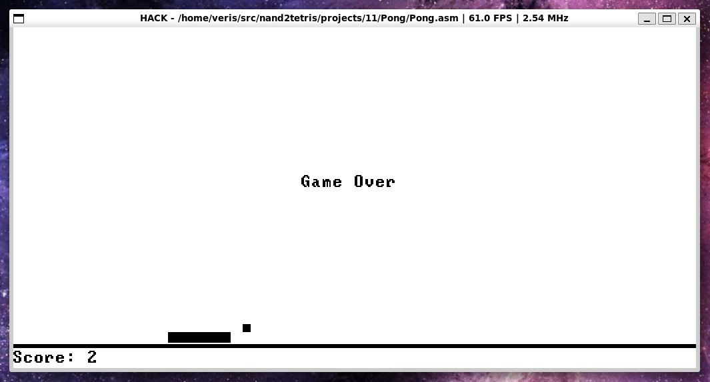
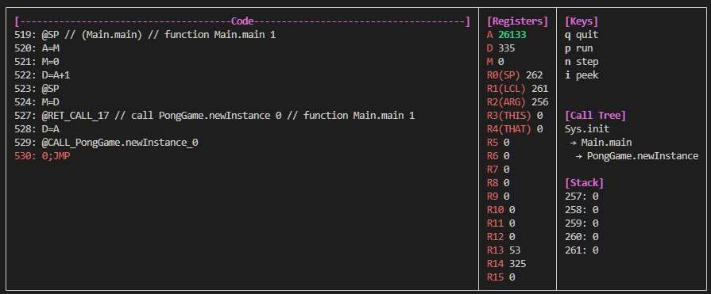

# nand2tetris

A collection of nand2tetris coursework plus reworked implementations of course tools to enhance the student/developer experience.

## Setup

```sh
# [dev] for test/lint dependencies
pip install -e ".[dev]"   
```

All Python scripts must be run from within the `interpreter/` directory.

```sh
cd interpreter
```

## Features / Usage

### emulator.py: Pygame HACK platform emulator

Pygame frontend that renders the memory-mapped screen and handles keyboard I/O while driving the CPU engine which interprets the symbolic HACK assembly.



```sh
python emulator.py path/to/file.asm                # run in emulator (default: 2x scale, 60 fps)
python emulator.py path/to/file.asm --scale 1      # custom display scale
python emulator.py path/to/file.asm --fps 30       # custom fps target
```

### debugger.py: HACK CPU debugger

Interactive CPU debugger with a rich TUI for interactive debugging. Highlights what registers are changing in current instruction and when `JMP` condition is satisfied.



```sh
python debugger.py path/to/file.asm                          # run a program
python debugger.py path/to/file.asm --break 42 100           # break at ROM (source asm) lines 42 and 100
python debugger.py path/to/file.asm --break Math.init        # break on entering Math.init
python debugger.py path/to/file.asm --break 42 String.init   # mix line numbers and function names
```

### debugger.py: Jack ASSERT directives

The following Jack directives will activate special test behaviour in the interpreter:

* `// ASSERT RAM[8000] = 6`: Assert the value of a RAM address after the execution of a `let` or `do` statement, e.g. `let r[0] = 2 * 3; // ASSERT RAM[8000] = 6`.
* `// ASSERT REACHABLE`: Assert this `let`, `do` or `return` statement is reachable at runtime, e.g. `return; // ASSERT REACHABLE`.

Jack files are statically scanned for `ASSERT` directives at runtime, if there are any mismatches or if the number of processed directives does not match the expected result an `AssertionError` exception will be thrown.

### runner.py: Fully automated end-to-end test suite

Orchestrates the entire pipeline end-to-end: compiles Jack → tokenizes → analyzes → compiles to VM → translates to ASM → assembles to HACK → executes and validates all tests (VMEmulator, CPUEmulator, HardwareSimulator, Tester, Interpreter).

```sh
python runner.py              # lint + run all tests
python runner.py --fpga       # include FPGA programs (projects/13_fpga)
python runner.py --debug      # verbose output
python runner.py --no-lint    # skip ruff linting
```

### compiler.py: Jack to VM compiler

Compiles Jack source files into VM bytecode and validates output against course compiler if present.

```sh
python compiler.py                          # compile all configured Jack files
python compiler.py path/to/file.jack        # compile a single file
python compiler.py path/to/project/dir      # compile all .jack files in a directory
```

### tokenizer.py: Jack lexer

Lexes Jack source into XML token streams (`*T.xml`).

```sh
python tokenizer.py                          # tokenize all configured Jack files
python tokenizer.py path/to/file.jack        # tokenize a single file
python tokenizer.py path/to/project/dir      # tokenize all .jack files in a directory
```

### analyzer.py: Jack parser

Parses token streams into CST (`*.xml`).

```sh
python analyzer.py                           # analyze all configured Jack files
python analyzer.py path/to/file.jack         # analyze a single file
python analyzer.py path/to/project/dir       # analyze all .jack files in a directory
```

### translator.py: VM to ASM translator

Translates VM bytecode directories into HACK assembly.

```sh
python translator.py                       # translate all configured VM directories
python translator.py path/to/vm/dir        # translate a single VM directory
```

### assembler.py: ASM to HACK assembler

Two-pass assembler that encodes HACK assembly into 16-bit binary.

```sh
python assembler.py                        # assemble all configured ASM files
python assembler.py path/to/file.asm       # assemble a single file
```

### tester.py: test script parser

Parses `.tst` test scripts and `.cmp` comparison files (used internally by `runner.py`).

```sh
python tester.py    # parse all configured test files
```

### Linting: ruff/pydoclint

Ruff and pydoclint run automatically as part of `runner.py`. To run manually:

```sh
ruff check interpreter/          # lint check
ruff format interpreter/ --check # format check (dry run)
ruff check interpreter/ --fix    # attempt to auto-fix lint issues
ruff format interpreter/         # apply formatting
pydoclint interpreter/           # docstring lint
```

Configuration lives in `pyproject.toml` at the repo root.

## Project Files

`projects/01-12` contains complete implementations of the the original [nand2tetris](https://www.nand2tetris.org/) course content.

`projects/13_fpga` contains FPGA-targeted Jack programs symlinked from [nand2tetris-fpga](https://github.com/c0ff33-dev/nand2tetris-fpga), a complete implementation and fork of Michael Schröder's [course](https://gitlab.com/x653/nand2tetris-fpga).

### FPGA layout

```
projects/13_fpga/
├── Original/     # symlinks to nand2tetris-fpga/07_Operating_System/01-12
│   ├── 01_GPIO_Test/
│   ├── ...
│   └── 12_Tetris/
└── Classic/      # symlinks to nand2tetris-fpga/09_More_Fun_to_Go/02-03
    ├── 02_Operating_System/
    └── 03_Pong/
```

Both repos must (optionally) be cloned as siblings under the same parent directory so the symlinks resolve:

```sh
git clone https://github.com/c0ff33-dev/nand2tetris.git
git clone https://github.com/c0ff33-dev/nand2tetris-fpga.git
```

The `--fpga` flag includes these programs in the test suite. Without it, `projects/13_fpga` is ignored.

## Java Tools

The original nand2tetris Java-based tools (`HardwareSimulator`, `CPUEmulator`, `VMEmulator`, etc.) are in `tools/` and require any modern version of the JRE:

```sh
# .bat on Windows
tools/HardwareSimulator.sh   
tools/CPUEmulator.sh
tools/VMEmulator.sh
```